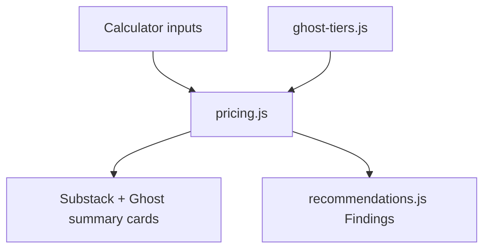
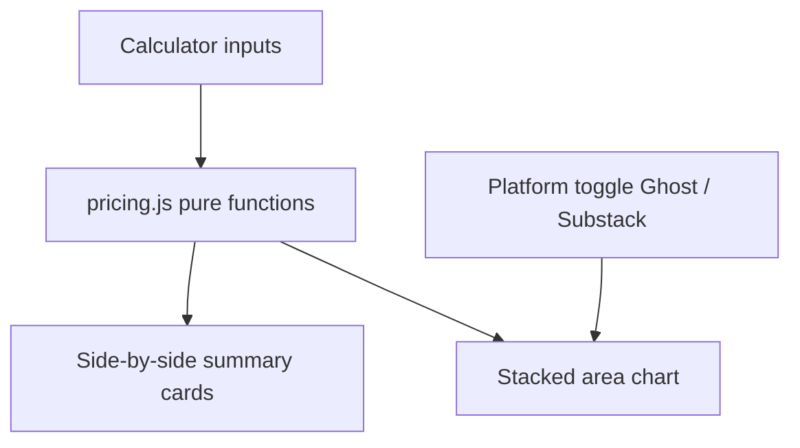

> Client-side Ghost vs Substack pricing calculator at [`/ghost-fees/`](/ghost-fees/). Side-by-side summary cards, break-even callouts, and contextual **Findings**—no chart in the shipped UI.

# Ghost Fees—pricing calculator

**URL:** [`/ghost-fees/`](../../ghost-fees/index.html) (Vite entry `ghostFees` in [`vite.config.js`](../../vite.config.js))

**Status:** Shipped. Static, client-only (no API).

## Current functionality



### Calculator inputs

| Control | Purpose |
|---------|---------|
| **Audience size** | Total registered members (free + paid)—drives Ghost(Pro) hosting tier |
| **Paid membership tiers** | One or more rows: paid subs count + price/mo (USD). **Add tier** / remove (when >1). Gross = sum of `count × price` per tier |
| **Ghost plan** | Segmented control on Ghost card: **Starter** \| **Publisher** \| **Business**. Starter disabled above 1,000 members |
| **Ghost billing** | **Annual** \| **Monthly** on Ghost card—switches hosting rate ladder |

Defaults: 1,000 audience, one tier with 100 paid subs at $3/mo, Publisher, annual billing.

### Summary cards (always both platforms)

Side-by-side **Substack** and **Ghost** cards at current inputs:

- Gross revenue, fee breakdown (platform / hosting / Stripe), **Income** (before taxes) monthly and annual
- **Winner badge** on the higher take-home card (e.g. `⭐️ Winner—$51/mo ($607/yr) more`)
- Ghost card embeds plan + billing controls and tier readout (plan name, hosting $/mo, member band)

**Ghost-only callouts** (when applicable):

- Paid subs needed to cover Ghost hosting (when net &lt; 0)
- ~% of readers on lowest paid tier to break even on hosting (all on lowest tier)
- Paid subs needed to beat Substack take-home

**Starter:** No paid memberships—gross/Stripe show as n/a; hosting-only comparison.

### Findings

[`recommendations.js`](../../ghost-fees/recommendations.js) builds contextual tips from the snapshot, e.g.:

- Small-creator Ghost vs Substack threshold at lowest tier
- Ghost Pro hosting step-ups at member breakpoints (1,001 / 2,501 / …)
- Whether current paid count is enough to absorb the next tier jump
- Conversion % needed to beat Substack when Ghost is behind today
- Starter as hosting-only option under 1,000 readers with no paid tiers

Rendered in a **Findings** section below the summary grid.

### Pricing model (implemented)

**Substack** ([fee article](https://support.substack.com/hc/en-us/articles/360037607131-How-much-does-Substack-cost)):

- $0 hosting; **10%** platform fee on gross paid revenue
- Stripe per charge: **2.9% + $0.30** + **0.7%** Stripe Billing on gross

**Ghost** ([pricing](https://ghost.org/pricing/)):

- **0%** platform fee on paid subscriptions (Publisher+)
- Tiered **Ghost(Pro)** hosting by member count in [`ghost-tiers.js`](../../ghost-fees/ghost-tiers.js)—Starter, Publisher, and Business ladders for **annual** and **monthly** billing (`verifiedDate: 2026-05-17`)
- Stripe per charge: **2.9% + $0.30** only (no Substack-style 0.7% billing line)
- **Starter:** hosting only; no paid tier revenue modeled

Multi-tier gross/Stripe computed in [`pricing.js`](../../ghost-fees/pricing.js) via `computeSubstackFromTiers` / `computeGhostFromTiers` and `computeSnapshot`.

**Out of scope:** Apple IAP; self-hosted Ghost; Custom/Enterprise above 100k (shown as custom in UI).

### File structure (current)

| File | Role |
|------|------|
| [`ghost-fees/index.html`](../../ghost-fees/index.html) | Page shell |
| [`ghost-fees/main.js`](../../ghost-fees/main.js) | UI, state, summary + callouts |
| [`ghost-fees/pricing.js`](../../ghost-fees/pricing.js) | Fee math, snapshots, break-even search helpers |
| [`ghost-fees/ghost-tiers.js`](../../ghost-fees/ghost-tiers.js) | Hosting tier tables + lookup |
| [`ghost-fees/recommendations.js`](../../ghost-fees/recommendations.js) | Findings copy |
| [`ghost-fees/ghostfees.css`](../../ghost-fees/ghostfees.css) | Page layout and card styles |

**Not present:** `chart.js` (removed—see [Deprecated: stacked area chart](#deprecated-stacked-area-chart) below).

### Site integration

- Home [`index.html`](../../index.html) links to `/ghost-fees/` with calculator blurb (no “coming soon”)
- [`README.md`](../../README.md) lists Ghost Fees at `/ghost-fees/`

---

## Deprecated: stacked area chart

> **Deprecated (removed from product).** The interactive chart was **built**, iterated (including negative-net Y-axis and a “journey” X-scale for 0→1,000 paying subs), then **removed** in favor of summary cards and inline break-even callouts. `ghostfees/chart.js` is no longer in the repo; chart CSS and series builders were deleted with it.

### Why it was removed

The chart compressed early milestones (10 / 100 / 1,000 paying subs) into a small slice of the plot, and the “growing list” model (`totalMembers = paying / conversion%`) obscured the more intuitive story: **fixed hosting for your current list while conversion is still low**. Break-even and Findings answer the same questions with less visual noise.

### What shipped instead

- Side-by-side summary cards (both platforms always visible—no chart platform toggle)
- Ghost break-even / beat-Substack / lowest-tier % callouts on the Ghost card
- **Findings** section for tier-step and conversion guidance

---

## Original plan (archived)

The sections below document the **initial build plan** at implementation time. Paths originally used `ghostfees/`; the app now lives at `ghost-fees/`. Treat inputs and UI as historical where they differ from [Current functionality](#current-functionality).

> Replace the Ghostfees stub with a client-side calculator and interactive stacked area chart. Users enter audience and monetization inputs; the chart toggles between Ghost and Substack, showing take-home revenue vs platform/Stripe fees as paying subscribers scale.

### Goal (original)

Build `/ghostfees/` as a static, client-only page (no API) that models [Ghost vs Substack](https://ghost.org/vs/substack/) economics using [Ghost(Pro) pricing](https://ghost.org/pricing/) and [Substack’s fee structure](https://support.substack.com/hc/en-us/articles/360037607131-How-much-does-Substack-cost).

### UX (original—included chart)



**Inputs (original)**

| Control | Purpose |
|---------|---------|
| Total subscribers | Newsletter list size (used for Ghost tier limits) |
| Paying customers | Toggle: **count** or **%** of total → derive the other |
| Price per month | Per paying subscriber (USD) |
| Ghost plan | Auto-selected from member tier, with manual override (Publisher default for paid) |

**Outputs at current inputs (original)**

- Gross monthly revenue
- Ghost: hosting + Stripe fees → **take-home**
- Substack: 10% platform + Stripe (2.9% + $0.30/txn + 0.7% billing) → **take-home**
- Delta (annualized) vs the other platform

### Chart specification (original—deprecated)

**Chart (per original preference)**

- **Toggle:** Ghost \| Substack (one platform visible at a time)
- **Stacked area** along X = paying subscribers (0 → sensible max, e.g. 2× current paying or 5,000)
- **Two colors per chart:** take-home pay (bottom) + fees (top: platform + Stripe combined)
- Holding **price/month** and **conversion %** fixed while sweeping paying subs; total list size = `paying / (conversion%)` for Ghost tier selection
- Hover/tooltip on points: gross, fees breakdown, net

**Later plan iterations (also deprecated)** added:

- Member-scaled Publisher + Business ladders; monthly vs annual billing
- Y-axis below zero when `net = gross - fees` is negative (e.g. Business at low paying counts)
- Optional “journey” X-scale (equal width for 0–10, 10–100, 100–max paying subs) and fixed-list vs growing-list modes

**Chart implementation (original—vanilla SVG)**

- No new npm dependencies
- `chart.js` responsibilities:
  - Compute series: for each X in `0..xMax` step size, `gross`, `fees`, `net`
  - Build stacked paths: `net` area (e.g. `--take-home`) + `fees` area (e.g. `--fees`) on shared baseline
  - Responsive: `viewBox` + `resize` listener; readable axis labels (paying subs / month)
  - Accessible: `aria-label` on chart, legend matching toggle platform

**Toggle behavior (original):** switching Ghost ↔ Substack re-rendered the chart with that platform’s fee function; summary cards always showed **both** for comparison.

### Pricing model (original—simplified tiers)

#### Substack

```js
// monthly, n = paying subscribers, p = price per month
gross = n * p
substackPlatform = gross * 0.10
stripe = n * (p * 0.029 + 0.30) + gross * 0.007
substackFees = substackPlatform + stripe
substackNet = gross - substackFees
```

#### Ghost (original flat tiers)

- **0%** platform fee on paid subscriptions (Publisher+)
- Flat **Ghost(Pro)** hosting by tier (yearly-equivalent monthly rates):
  - Starter **$18**/mo—no paid subscriptions (disabled in UI when monetizing)
  - Publisher **$29**/mo—up to **1,000** members
  - Business **$199**/mo—up to **10,000** members
- Stripe per charge: **2.9% + $0.30**

```js
ghostHosting = tierMonthlyRate(plan)
stripe = n * (p * 0.029 + 0.30)
ghostFees = ghostHosting + stripe
ghostNet = gross - ghostFees
```

#### Sanity check (original)

1,000 paying × $5/mo → gross $5,000/mo. Substack fees ≈ $650/mo → net ~$4,350. Ghost Publisher $29 + Stripe ≈ $175 → net ~$4,796. Matches [Ghost vs Substack](https://ghost.org/vs/substack/) narrative (~$7.5k/yr advantage).

### File structure (original)

| File | Role |
|------|------|
| `ghostfees/index.html` | Layout: nav, inputs, toggle, chart SVG container, summary, sources footer |
| `ghostfees/main.js` | Wire inputs, recompute, render chart + summaries |
| `ghostfees/pricing.js` | Pure functions + constants (testable, no DOM) |
| `ghostfees/chart.js` | SVG stacked-area renderer (no chart library)—**removed** |
| `ghostfees/ghostfees.css` | Page layout, form, chart colors, toggle |

### UI sections (original)

1. **Header**—title, short blurb, link to Ghost comparison
2. **Calculator**—number inputs with sensible defaults
3. **Platform toggle**—segmented control: Ghost \| Substack
4. **Chart**—stacked area + legend (Take-home / Fees)—**removed**
5. **Summary cards**—two columns at current inputs: gross, fee breakdown lines, net monthly + annual
6. **Assumptions footnote**—cite sources, note Stripe-only model, Apple IAP excluded, Ghost tier limits, yearly Ghost rates

### Testing (original)

- Export `pricing.js` functions and verify the 1,000 × $5 example in a short comment block or manual checklist
- Manual: `pnpm dev` → `/ghost-fees/`, adjust inputs, confirm Substack fees exceed Ghost at scale

### Out of scope (original)

- Apple IAP / non-card Stripe methods
- Ghost monthly-vs-yearly billing surcharge toggle (later added as billing control on Ghost card)
- Self-hosted Ghost (only Ghost(Pro))
- Backend / API
