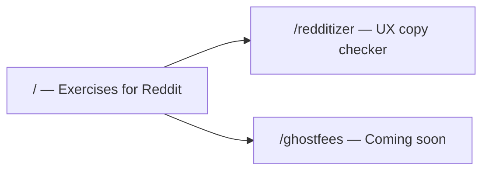

> Restructure the Vite project into a multi-page site with a new "Exercises for Reddit" home at `/`, move the existing Redditizer app to `/redditizer/`, add a Ghostfees coming-soon stub at `/ghostfees/`, and add Netlify config for static deployment.

# Multi-page site with directory home

## Current state

- Single entry: [`index.html`](index.html) at `/` loads [`src/main.js`](src/main.js) (full Redditizer UI).
- No client router; no `ghostfees` code anywhere.
- Dev API via Vite proxy in [`vite.config.js`](vite.config.js); production API not wired for hosting.

## Target URL map



| Path | Page |
|------|------|
| `/` | Directory home: title **Exercises for Reddit**, cards/links to sub-apps |
| `/redditizer/` | Existing prototype (unchanged behavior) |
| `/ghostfees/` | Stub: short description of planned calculator/graph, “Coming soon” |

## Architecture: Vite multi-page (MPA)

Use Vite’s [multi-page build](https://vite.dev/guide/build.html#multi-page-app) with three HTML inputs. Keep Redditizer source in [`src/`](src/) (no need to duplicate `server/` or move JS yet).

**Proposed layout after change:**

```
index.html                 # new landing
redditizer/index.html      # moved from root (script: /src/main.js)
ghostfees/index.html       # new stub
src/
  site.css                 # shared tokens + landing/stub layout (new)
  style.css                # Redditizer-specific (unchanged)
  main.js, api.js, ...     # unchanged paths
netlify.toml               # new
```

**[`vite.config.js`](vite.config.js)** — add `build.rollupOptions.input`:

```js
import { resolve } from 'node:path'

rollupOptions: {
  input: {
    main: resolve(__dirname, 'index.html'),
    redditizer: resolve(__dirname, 'redditizer/index.html'),
    ghostfees: resolve(__dirname, 'ghostfees/index.html'),
  },
},
```

Keep existing `server.proxy` for `/api` so Redditizer still works in local dev from any page origin on `:5173`.

## Page content

### 1. Landing — [`index.html`](index.html) (new root)

- `<title>Exercises for Reddit</title>`
- Minimal markup: site title, one-line intro, two linked cards:
  - **Redditizer** — “Crude prototype of an LLM-based quality checker for UI strings” → `/redditizer/`
  - **Ghostfees** — “Compare Ghost.org and Substack pricing (calculator & graph coming soon)” → `/ghostfees/`
- Link [`src/site.css`](src/site.css) only (no JS required).

Reuse design tokens from [`src/style.css`](src/style.css) (`--bg`, `--accent`, `--text-muted`, etc.) so the home feels consistent with Redditizer without importing the full Redditizer stylesheet.

### 2. Redditizer — [`redditizer/index.html`](redditizer/index.html)

- Move current root [`index.html`](index.html) here verbatim except:
  - Add a small top nav: `← Exercises for Reddit` linking to `/`
  - Optionally tweak `<title>` to stay “Redditizer — UX copy review”
- Script stays `type="module" src="/src/main.js"` (root-absolute path works in Vite MPA).

**Small UI tweak in [`src/main.js`](src/main.js):** prepend the back link in the header block (or add a `<nav class="site-nav">` above `.layout`) so it appears on the live app without duplicating HTML in two places—prefer editing `main.js` innerHTML once rather than maintaining nav in both HTML and JS.

### 3. Ghostfees stub — [`ghostfees/index.html`](ghostfees/index.html)

- Same nav back to `/`
- Heading **Ghostfees**, subtitle describing the planned feature (Ghost vs Substack pricing, reader count, subscriber revenue, interactive graph)
- Prominent “Coming soon” state (no calculator/chart in this effort per your choice)
- [`src/site.css`](src/site.css) for layout; no new dependencies

## Netlify deployment

Add [`netlify.toml`](netlify.toml):

```toml
[build]
  command = "pnpm build"
  publish = "dist"

[dev]
  command = "pnpm dev"
  targetPort = 5173
```

**Static routing:** Vite emits `dist/index.html`, `dist/redditizer/index.html`, and `dist/ghostfees/index.html`. Netlify serves these as `/`, `/redditizer/`, and `/ghostfees/` automatically—no SPA catch-all rewrite needed.

**API caveat (document, don’t block this PR):** Redditizer’s [`src/api.js`](src/api.js) calls `/api/*`. That works locally via the Vite proxy; on Netlify production, analyze/extract will fail until you either:

- Add Netlify Functions (or Edge) that wrap [`server/index.js`](server/index.js) logic and a redirect `from = "/api/*"`, or
- Host the Node API elsewhere and set `VITE_API_BASE` in the frontend (small follow-up change to `api.js`).

For this scope, README will note: **static pages deploy on Netlify; full Redditizer on production needs API wiring in a follow-up.** Local `pnpm dev` remains the primary way to use Redditizer.

**Secrets:** Configure `ANTHROPIC_API_KEY` / `GOOGLE_API_KEY` in Netlify only when API functions are added—not required for the landing + stub deploy.

## Docs and scripts

- Update [`README.md`](README.md): open `http://localhost:5173/` for home; Redditizer at `/redditizer/`; mention Ghostfees stub; add Netlify deploy one-liner (`pnpm build`, publish `dist`).
- [`package.json`](package.json) scripts unchanged (`dev`, `build`, `preview` still valid).

## Verification checklist

1. `pnpm dev` → `/` shows directory; `/redditizer/` runs full analyze flow; `/ghostfees/` shows stub.
2. `pnpm build && pnpm preview` → same three routes from `dist/`.
3. Nav links: subpages → home; home → subpages.
4. No broken asset paths (Vite hashes per entry under `dist/assets/`).

## Out of scope (follow-ups)

- Full Ghostfees calculator + chart
- Netlify Functions / production API for Redditizer
- Custom domain or `base` path changes (not needed for root-hosted Netlify site)

